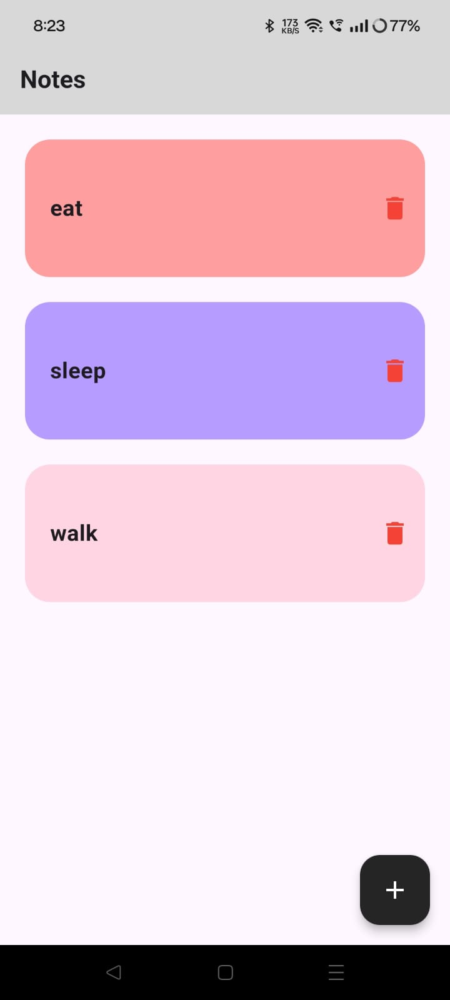
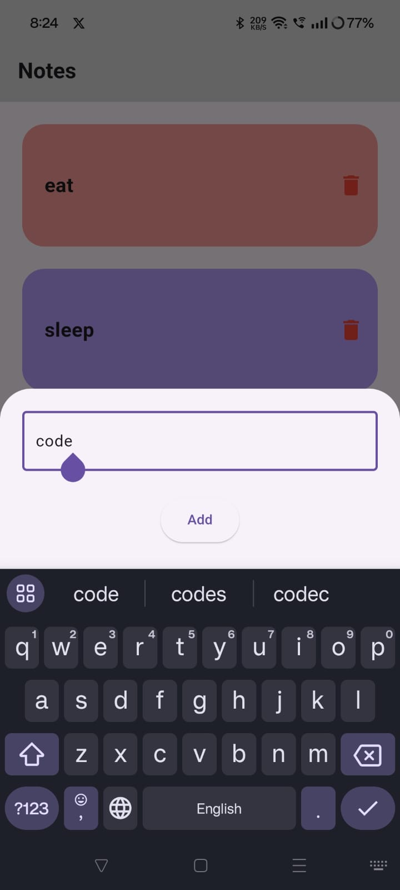

# Note App

This is a simple Note App created as a learning project. The app demonstrates using the path_provider package and Dart's I/O capabilities to read, write, and manage text files in Flutter. It is designed for anyone who wants to understand how to work with local file storage in Flutter while implementing practical features like adding, displaying, and deleting notes.

## Features
 1. Add notes via a user-friendly bottom sheet input.
 2. Display a list of notes with a visually appealing card design.
 3. Delete individual notes, with changes reflected in both the UI and the underlying file.
 4. Persistent storage using local files, ensuring notes are saved even after the app restarts.

## Purpose

This project was created to solidify my learning of the path_provider package and Dart's file-handling APIs. It is a beginner-friendly project idea for those exploring file management in Flutter. If you've recently learned about path_provider and are wondering what to build next, this project is a great way to apply your knowledge.

## Screenshots

<div align = "center">
  
  
</div>

## How It Works

Adding Note: When a user enters a note, it is appended to a local text file using Dart's FileMode.append. The note is displayed immediately in the list.
Reading Notes: On app startup, all notes are read from the local file and displayed in the app.
Deleting Notes: Users can delete notes by pressing the delete button. The note is removed from both the list and the file.

## Key Technologies

Flutter: UI framework for building cross-platform apps.
Dart: Programming language used in Flutter.
Path Provider: For locating the app's document directory.
Dart I/O: For file handling (reading and writing files).

## Installation

Clone the repository:
```
git clone [https://github.com/your-username/note-app.git](https://github.com/Pinkisingh13/note_app.git)
```
Navigate to the project directory:
```
cd note-app
```
Install dependencies:
```
flutter pub get
```
Run the app:
```
flutter run
```
## Lessons Learned

 1. Using the path_provider package to locate device-specific storage directories.
 2. Handling file I/O operations like reading, writing, and appending data.
 3. Managing state in Flutter to reflect changes in the UI.

## Follow Me
For more of my learning projects and insights:
- **<a href="https://www.linkedin.com/in/your-linkedin-profile" target="_blank">LinkedIn</a>**: Stay updated on my professional journey.
- **<a href="https://medium.com/@your-medium-profile" target="_blank">Medium</a>**: Read about my learnings and projects.

## Contribution
This project is intended as a learning tool, but contributions are welcome! If you have suggestions or improvements, feel free to open an issue or submit a pull request.

## Feel free to use or adapt this project for your own learning or development purposes!


